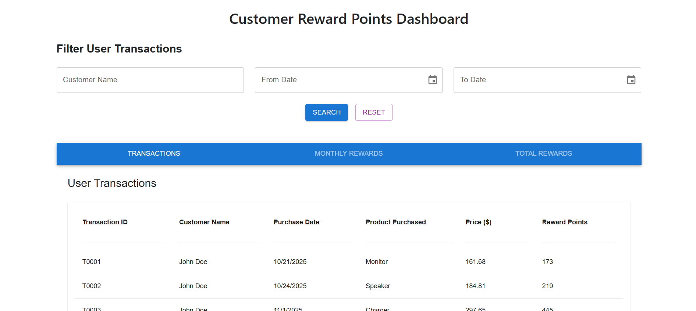
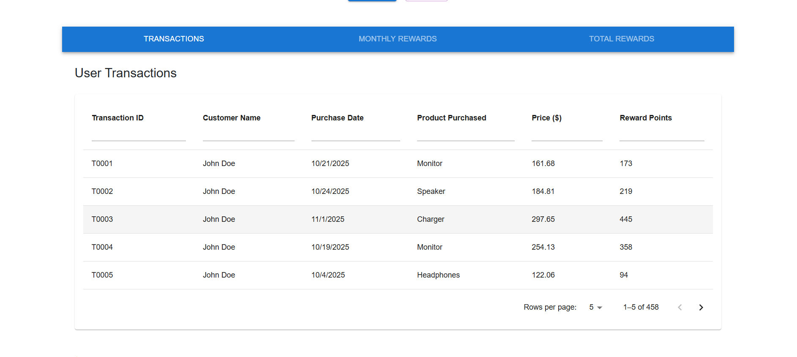
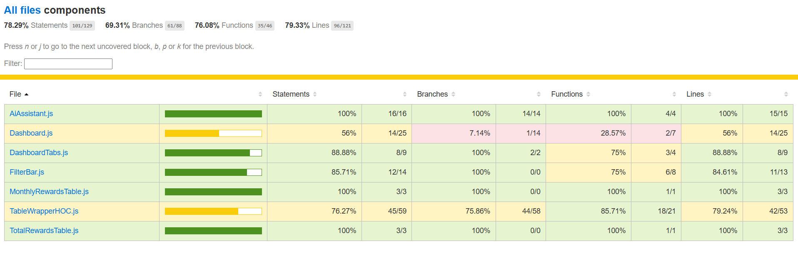

# 🏆 Customer Rewards Dashboard

A React-based interactive dashboard for managing and analyzing customer reward points.  
It features a filterable data table, reward point summaries, and an AI Insights Assistant powered by OpenAI.  
This project also includes Jest + React Testing Library for component-level testing.

---

## 🚀 Features

✅ Interactive Dashboard for viewing customer transactions and reward summaries  
✅ Filter Bar to search by name, product, and date range  
✅ Paginated Table with sorting and search  
✅ AI Assistant that answers queries about the transaction data  
✅ Data fetched from mock JSON files or an API  
✅ Responsive UI built with Material UI (MUI)  
✅ Unit Tests for all components using Jest & React Testing Library  
✅ High Code Coverage (≈80%)

---

## 🧱 Tech Stack

| Category | Technology |
|-----------|-------------|
| Frontend | React 18+, Material UI, Day.js |
| AI | OpenAI API (or HuggingFace API key) |
| Testing | Jest, React Testing Library |
| Build Tool |Create React App |
| Date Handling | Day.js |
| Utils | Axios, Custom helper functions |

---

## 📦 Project Setup

### 1️⃣ Clone the Repository
```bash
git clone https://github.com/Azeem1997/FreeMcD-main.git
cd FreeMcD-main
```

### 2️⃣ Install Dependencies
```bash
npm install
```

### 4️⃣ Run the App
```bash
npm start
```
The app will open at: http://localhost:3000

---

## 🧩 Project Structure

FreeMcD-main/
│
├── src/
│   ├── components/
│   │   ├── DashboardTabs.js
│   │   ├── FilterBar.js
│   │   ├── TableWrapper.js
│   │   ├── MonthlyRewardsTable.js
│   │   ├── TotalRewardstable.js
│   ├   ├── Transactiontable.js
│   │   ├── Dashboard.js
│   │   └── AIAssistant.js
│   │── __tests__/ (All Jest test files)
│   ├── utils/
│   │   ├── fetchRewardsData.js
│   │   ├── aiHelper.js
│   │   ├── calculatePoints.js
│   │   ├── commonUtils.js
│   ├── App.js
│   └── index.js
│
├── public/
│   ├── index.html
│   └── logo.png
│   │
│   └── mockData1.json
│
├── package.json
├── .env
└── README.md

---

### 🪟 Dashboard
- Loads mock data using `fetchData()`.
- Calculates monthly and total reward points.
- Displays charts and tables.

### 🎚 FilterBar
- Filters by name, product, and date range dynamically.

### 💬 AI Assistant
- Uses transactions as context and queries OpenAI API.

### 🧮 TableWrapper (HOC)
- Handles sorting, filtering, and pagination.



---

## 🧪 Testing

Run all tests:
```bash
npm test
```
Run coverage:
```bash
npm test -- --coverage
```

---

## 🧰 Utilities

- `fetchRewardsData.js` — Fetches mock/live data.
- `aiHelper.js` — Handles AI API securely.

---

## 📊 Example Output

Dashboard includes:
- Total rewards summary
- Monthly rewards chart
- Filterable transaction table
- AI Insights Assistant

---

## ⚙️ Build for Production
```bash
npm run build
```

---

## 🧑‍💻 Author
**S Azeem**  

---
